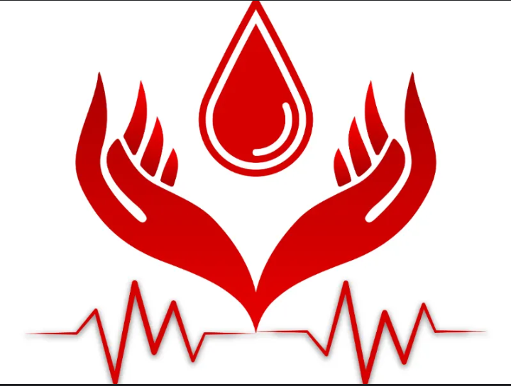

# Blood Donation Campaign Dashboard



## 🩸 Overview

This project implements a comprehensive dashboard for blood donation campaign analysis and management. The dashboard visualizes and analyzes blood donation data to provide valuable insights for optimizing blood donation campaigns. It allows campaign organizers to make data-driven decisions to improve the success of future blood donation campaigns.

## 📋 Features

The dashboard addresses key questions through the following features:

### 1. Geographic Distribution
- Visualizes the geographical distribution of blood donors based on their residential area (arrondissement and quartier)
- Displays an interactive map highlighting regions with high or low participation
- Allows filtering by specific arrondissements and neighborhoods

### 2. Health Conditions & Eligibility
- Visualizes the impact of health conditions (hypertension, HIV, asthma, diabetes, etc.) on blood donation eligibility
- Displays charts showing eligible vs. non-eligible donors based on these conditions
- Ranks rejection reasons by frequency

### 3. Donor Profiles
- Uses clustering techniques to group donors based on demographic and health-related features
- Generates insights into the characteristics of ideal blood donors
- Visualizes key donor characteristics

### 4. Campaign Effectiveness
- Analyzes past campaigns by examining donation dates and demographic factors
- Visualizes trends such as when blood donations are highest and which demographics contribute more
- Provides metrics like conversion rate, cost per donor, and ROI

### 5. Donor Retention
- Investigates how often individuals return to donate blood
- Analyzes demographic factors that correlate with repeat donations
- Provides cohort analysis of donor retention over time

### 6. Sentiment Analysis
- Performs sentiment analysis on donor feedback
- Classifies feedback into positive, negative, or neutral categories
- Visualizes sentiment trends through word clouds and charts

### 7. Eligibility Prediction Model
- Implements a machine learning model that predicts eligibility based on demographic and health data
- Wraps the model in a FastAPI interface for real-time predictions
- Provides detailed explanations for ineligibility reasons with severity ratings

## 🔧 Technical Architecture

The project consists of the following components:

1. **Main Dashboard (`dashboard.py`)**
   - Central application with tabs for different analyses
   - Handles data loading, processing, and visualization
   - Provides interactive filters and navigation

2. **Geographic Visualization (`dashboard_map.py`)**
   - Interactive map visualization using Folium
   - Allows filtering by arrondissements and neighborhoods
   - Displays donor concentration by region

3. **Eligibility Prediction Model (`dashboard_model.py`)**
   - Interface for the blood donation eligibility prediction model
   - Form for entering donor information
   - Displays prediction results and ineligibility reasons

4. **API Layer (`api.py`)**
   - FastAPI implementation for the eligibility prediction model
   - Handles input validation and preprocessing
   - Returns prediction results with detailed eligibility information

## 🚀 Installation & Setup

### Prerequisites
- Python 3.8+
- pip package manager

### Dependencies
The project requires the following main libraries:
```
streamlit
pandas
numpy
plotly
folium
scikit-learn
nltk
geopandas
matplotlib
seaborn
fastapi
joblib
wordcloud
```

### Installation Steps

1. Clone the repository:
```bash
git clone https://github.com/yourusername/blood-donation-dashboard.git
cd blood-donation-dashboard
```

2. Create a virtual environment (recommended):
```bash
python -m venv venv
source venv/bin/activate  # On Windows: venv\Scripts\activate
```

3. Install the required packages:
```bash
pip install -r requirements.txt
```

4. Ensure the data directory structure is set up:
```
BLOOD-CAMPAIGN-DASHBOARD/
├── data/
│   ├── candidates_2019_cleaned.csv
│   ├── data_2019_cleaned.csv
│   └── geoBoundaries-CMR-ADM3.geojson
├── Images/
│   ├── blood2.png
│   └── codeflow.png
├── models/
│   ├── blood_donation_model.joblib
│   ├── label_encoder.joblib
│   ├── preprocessor.joblib
│   └── hemoglobin_bin_edges.joblib
```

## 🖥️ Running the Application

### Starting the API Service
1. Start the eligibility prediction API:
```bash
uvicorn api:app --reload
```
The API will run on `http://127.0.0.1:8000`

### Starting the Dashboard
2. In a separate terminal window, run the Streamlit dashboard:
```bash
streamlit run dashboard.py
```
The dashboard will open in your default web browser at `http://localhost:8501`

## 🧪 Using the Dashboard

### Navigation
- Use the tabs at the top of the dashboard to navigate between different analysis views
- Use the sidebar to upload files and apply filters like age range, weight, gender, and district

### Data Upload
1. Click on "🗀 File Input" in the sidebar
2. Upload the following files:
   - Donor data (CSV file starting with "donor")
   - Candidate data (CSV file starting with "candidates")
   - Campaign data (Excel file starting with "campaign")

### Eligibility Prediction
1. Navigate to the "Eligibility Prediction" tab
2. Fill in the demographic and health information
3. Click "Predict" to see the eligibility result and reasons if ineligible

### Visualizations
- Interact with charts by hovering, zooming, or clicking
- Use filter options to drill down into specific segments of the data
- Download visualizations using the built-in export functionality

## 📊 Data Dictionary

Key fields in the dataset:

| Field | Description |
|-------|-------------|
| Age | Age of the donor/candidate |
| Genre | Gender (Homme/Femme) |
| Taille | Height in cm |
| Poids | Weight in kg |
| Niveau_d_etude | Education level |
| Situation_Matrimoniale_SM | Marital status |
| Profession | Occupation |
| Arrondissement_de_residence | District of residence |
| Quartier_de_Residence | Neighborhood of residence |
| Nationalite | Nationality |
| Religion | Religion |
| A_t_il_elle_deja_donne_le_sang | Whether the person has donated blood before (Oui/Non) |
| Taux_dhemoglobine | Hemoglobin level |
| ELIGIBILITE AU DON | Eligibility status |

## 🔒 Data Privacy Considerations

This dashboard handles sensitive health data and implements the following privacy measures:

- All data is processed locally within the application
- No personal identifiers are displayed in visualizations
- Aggregated data is used for trends and patterns
- No data is stored outside the local environment

## 👥 Contributors

Team CodeFlow

## 📃 License

This project is licensed under the MIT License - see the LICENSE file for details.

## 🙏 Acknowledgments

This project was created as part of the IndabaX Cameroon blood donation dashboard competition to help improve blood donation campaigns management through data analysis and visualization.